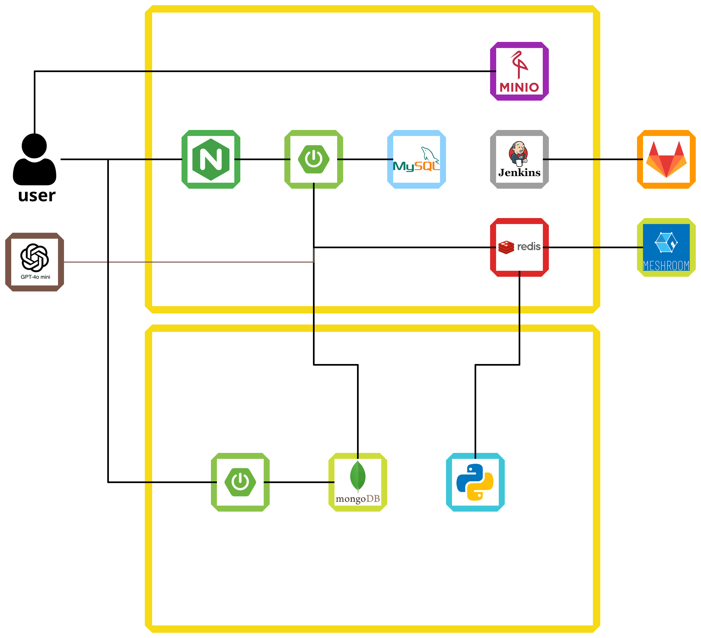
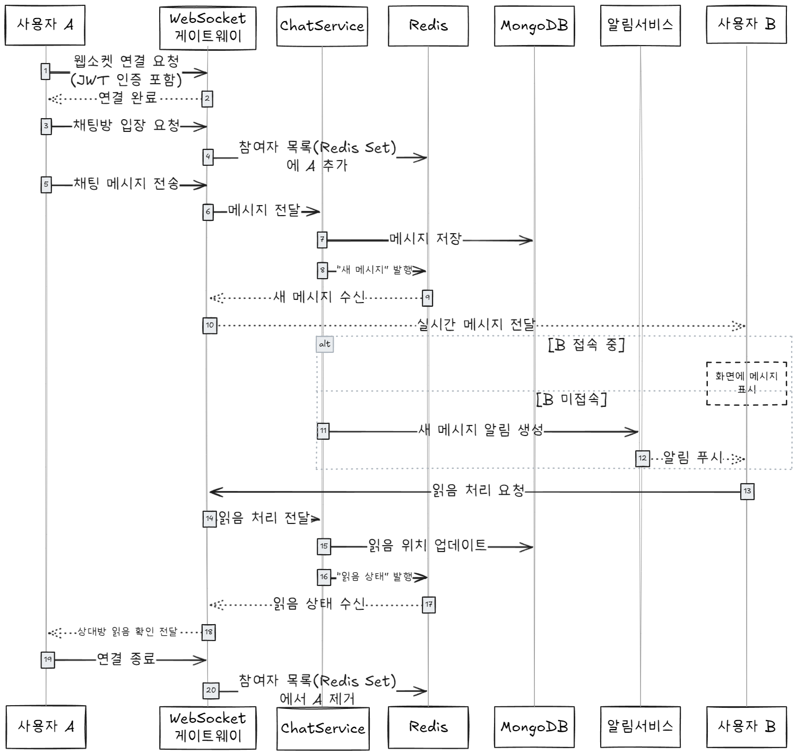
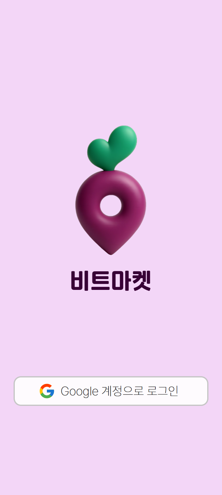
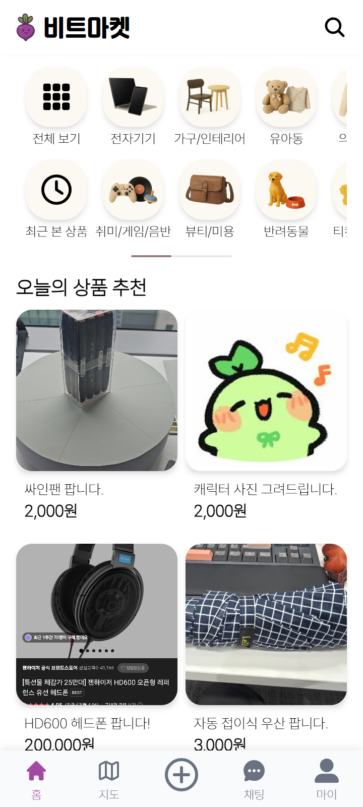
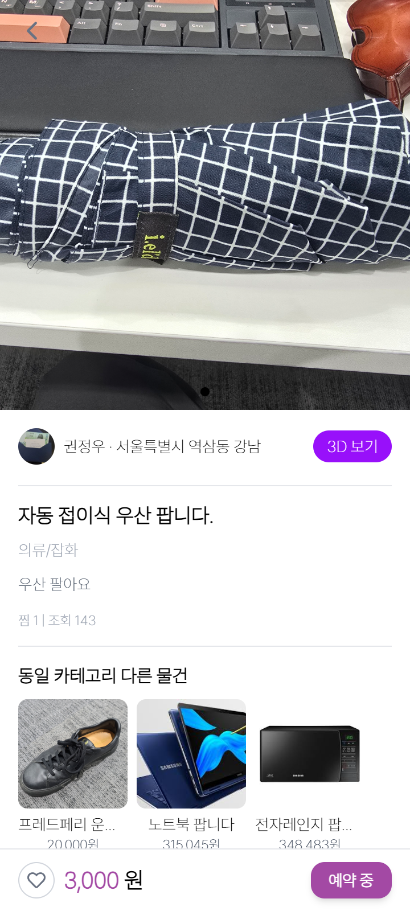
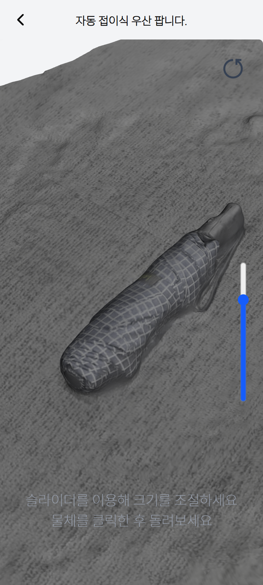
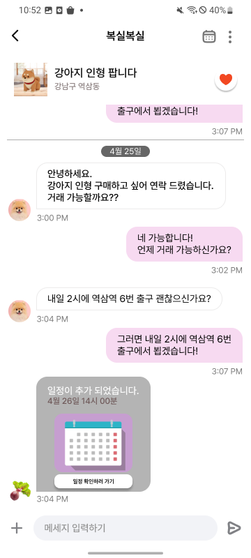

# 🧩 3D 기반 중고거래 플랫폼, 비트마켓 (BitMarket)

> 📁 이 저장소는 SSAFY 12기 특화 프로젝트 **「비트마켓」** 중  
> 제가 직접 구현한 **백엔드 핵심 기능 중심**으로 구성된 개인 포트폴리오입니다.  
> 전체 프로젝트는 2025년 4월부터 5월까지 약 5주간 진행되었습니다.

 

## 🛠️ 기술 스택

### Backend

### Infra

### Tools

 

## 🏗️ 시스템 아키텍처

- Spring Boot API 서버 + 채팅 서버
- Redis: Pub/Sub, Set, Stream 전반 활용
- MongoDB + MySQL 이중 저장소 구성
- MinIO: 사용자 업로드 미디어 저장소
- Jenkins + EC2 기반 CI/CD 구축
- 외부 연동 API: ChatGPT, Meshroom

 

## 🧑‍💻 담당 역할

- Redis 기반 **1:1 실시간 채팅 시스템** 설계 및 구현
- **미디어 비동기 처리 구조** 설계 (Presigned URL + Redis Stream + Worker)
- **OAuth 소셜 로그인 및 JWT 인증/인가** 로직 구현
- **ChatGPT API 연동**을 통한 채팅 기반 거래 약속 추천 자동화
- 시스템 아키텍처 설계 및 배포 환경 구성 참여

 

## 💡 주요 구현 기능

### ✅ 실시간 채팅 시스템
- **Redis Set**을 이용한 채팅방 참여자 관리 및 입장/퇴장 추적
- **Redis Pub/Sub**을 통해 실시간 메시지 송수신 및 읽음 처리 브로드캐스트
- **MongoDB**에 읽음 커서(`lastReadId`) 저장하여 `O(1)` 복잡도로 미읽음 메시지 수 계산
- 수신자 미접속 시 **알림(Notification)** 자동 저장 및 발송
- 

### ✅ 미디어 비동기 처리 시스템
- 클라이언트는 **Presigned URL**로 직접 MinIO에 이미지/영상 업로드
- 업로드 완료 후 Redis Stream에 변환 요청 메시지 등록
- **Python 기반 Worker**가 Redis Stream을 비동기 소비 → 3D 모델 변환 및 썸네일 생성 수행

### ✅ 인증/인가 시스템
- OAuth2(Google) 기반 소셜 로그인
- JWT 기반 사용자 인증/인가

### ✅ 거래 약속 자동 추천
- 채팅 메시지를 분석해 적절한 시간/장소 추천
- **ChatGPT API** 연동으로 대화 맥락 기반 자동화

 

## 🐞 트러블슈팅 사례

### 1. WebSocket 인증 문제
- **문제**: WebSocket 연결 시 `Authorization` 헤더 사용 불가
- **해결**: access-token을 `쿼리 파라미터`로 전달하여 인증 처리

### 2. 배포 환경에서 WebSocket 연결 실패
- **문제**: 프론트 배포 환경에서 WebSocket 연결 자체가 되지 않음
- **해결**: `.withSockJS()` 제거 → 순수 WebSocket으로 구조 단순화

 

## 🖼️ 이미지

